# Strickmaschinen-Wartung
## Material  
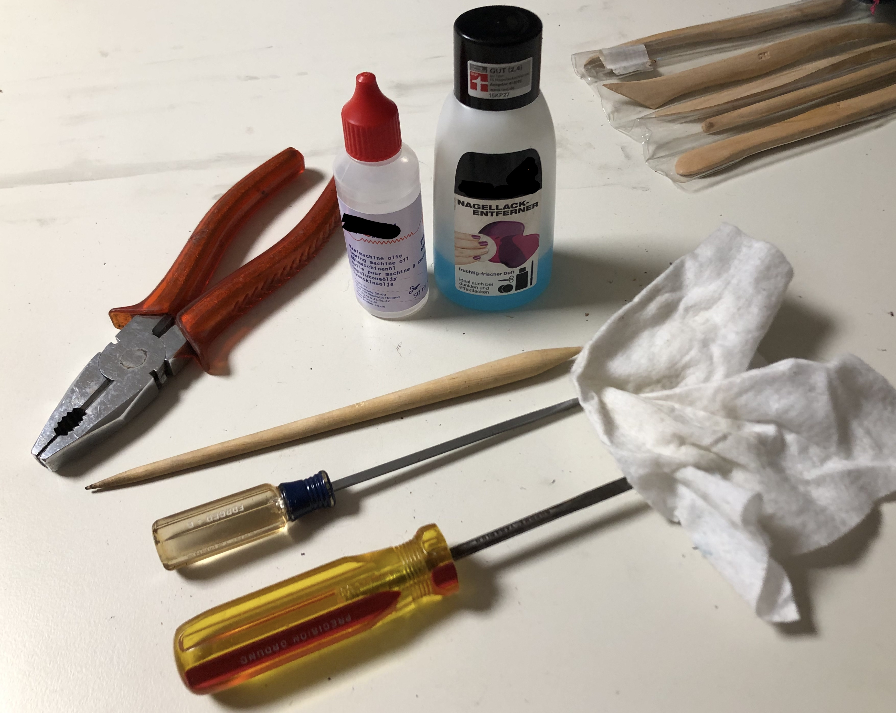  

- Schraubenzieher (Schlitz, verschiedene Breiten)
- Zange
- Putztuch
- Nagellackentferner/Aceton
- Pinsel
- Zahnstocher/Holzstab
- Nähmaschinenöl
- viel Platz

## Vorgehen
- Feststellschrauben entfernen 
- Schlitten entfernen  
  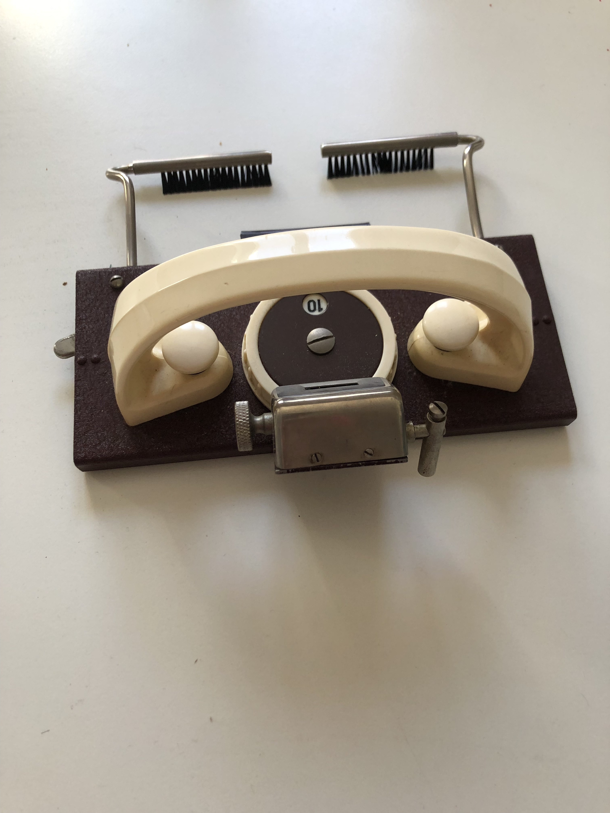
- weiße Seitenteile abschrauben  
  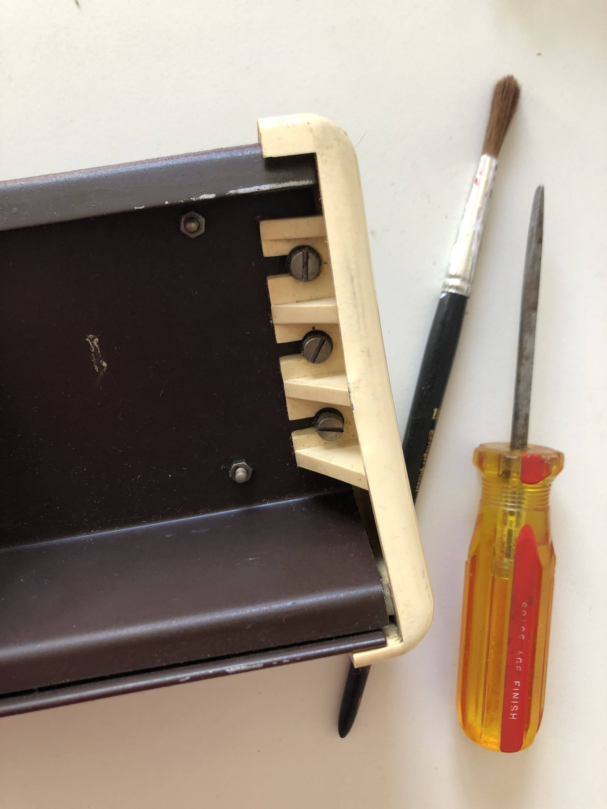  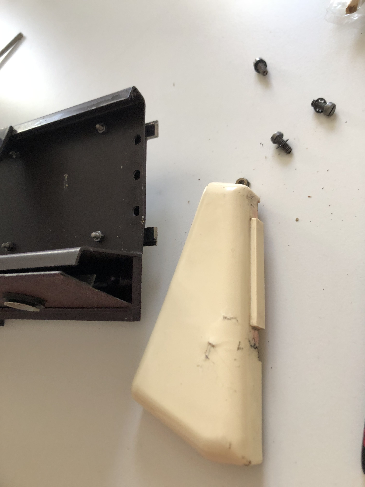
- vordere Abdeckplatte entfernen  
  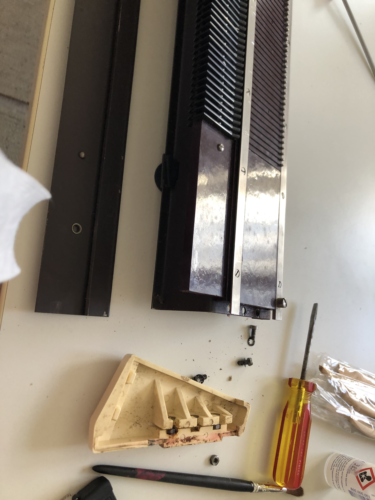
- vordere Metallschiene entfernen  
  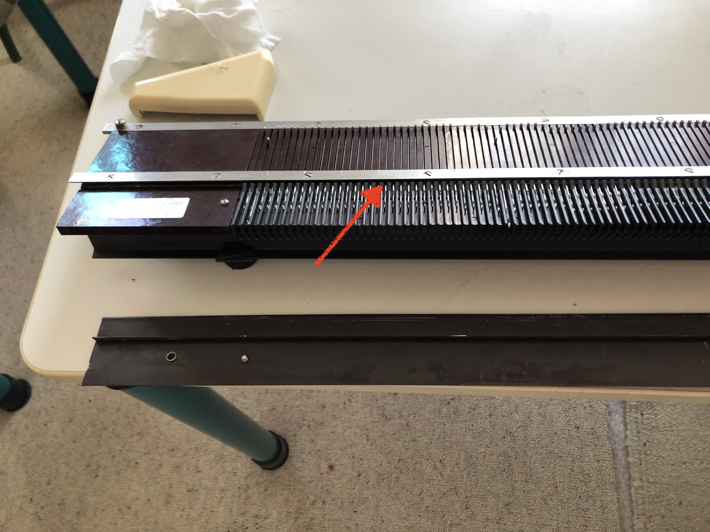
- hintere muss nicht entfernt werden
- Nadeln ausbauen und in der Reihenfolge hinlegen, in der sie in der Maschine eingebaut waren  
  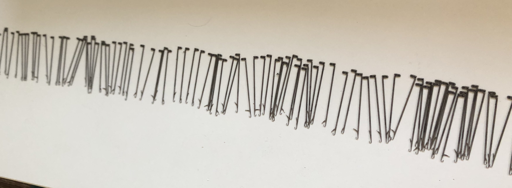
- Plättchen entfernen, dabei auf die Federn achten, auch diese in gleicher Reihenfolge hinlegen  
  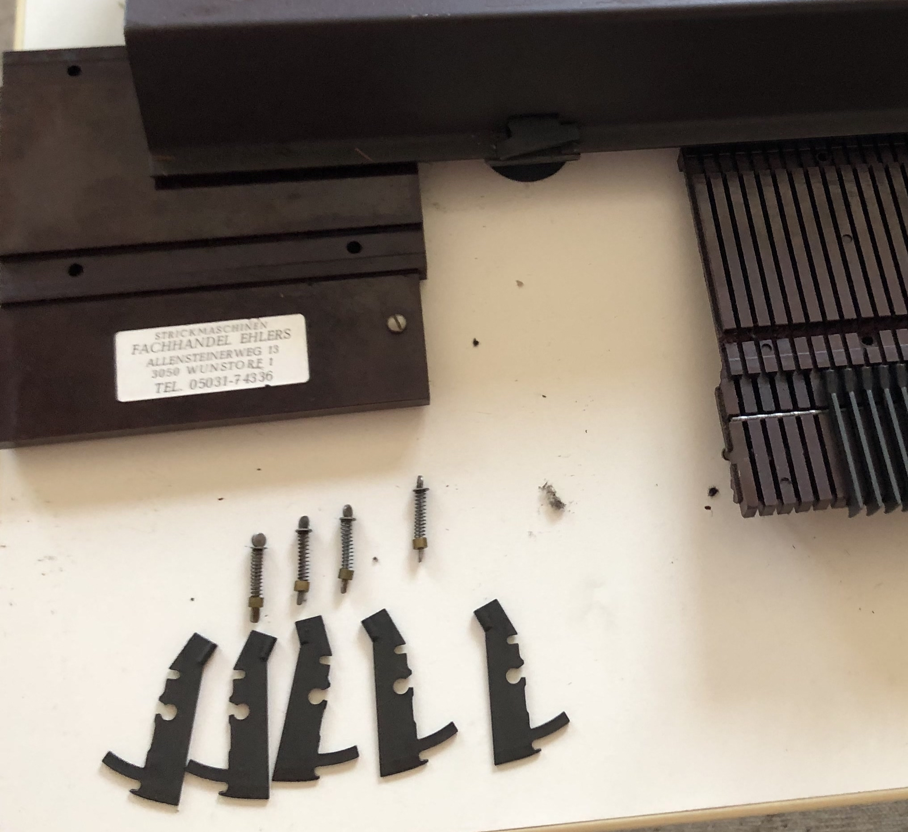
- Plättchen mit Nagellackentferner reinigen
- Federn mit Nadellackentferner reinigen
- Metallschiene mit Nagellackentferner reinigen
- Staub und Fadenreste mit Pinsel oder Zahnstocher aus den Fugen entfernen
- Plättchen und Federn wieder einbauen, dabei darauf achten, dess das Plättchen nicht seitlich durchrutscht  
  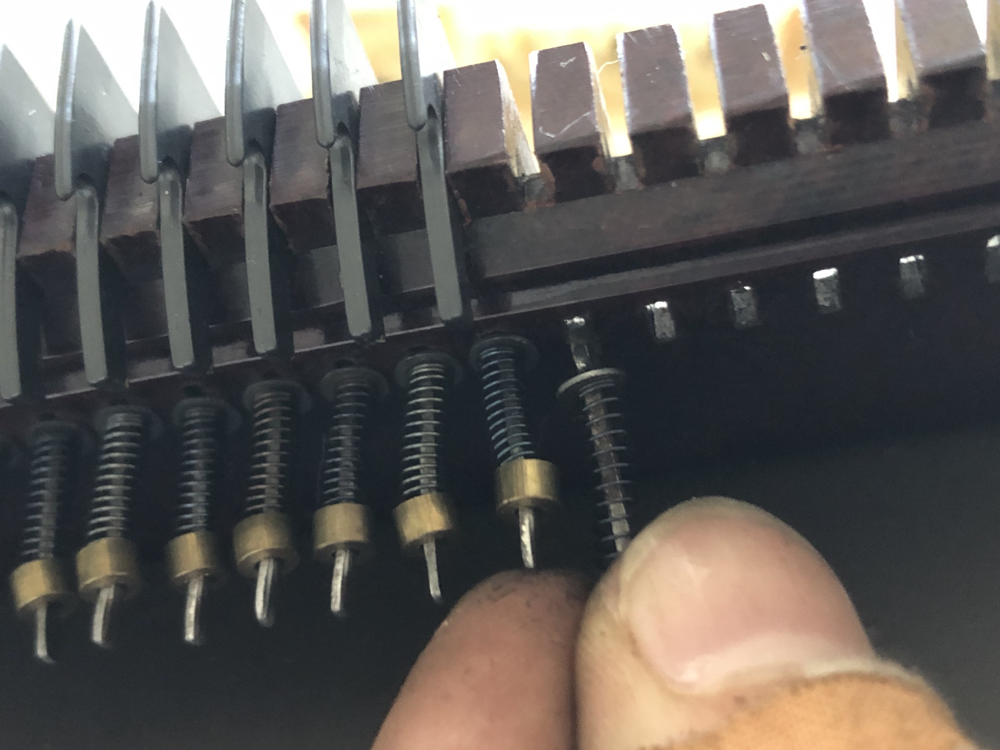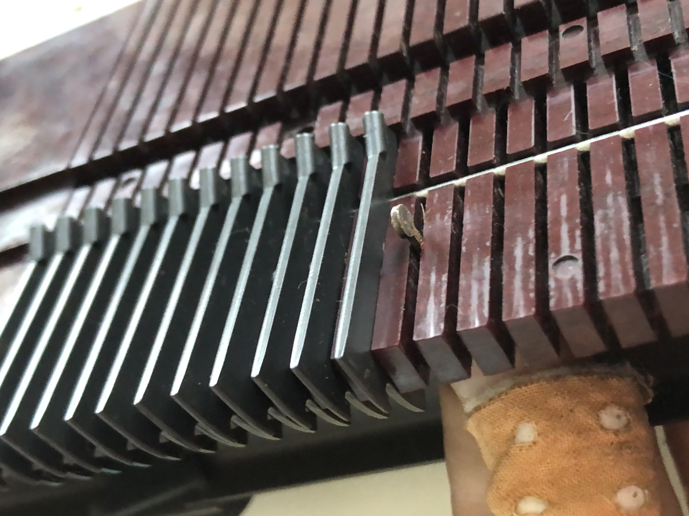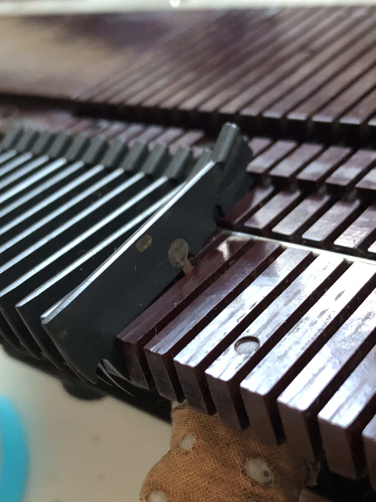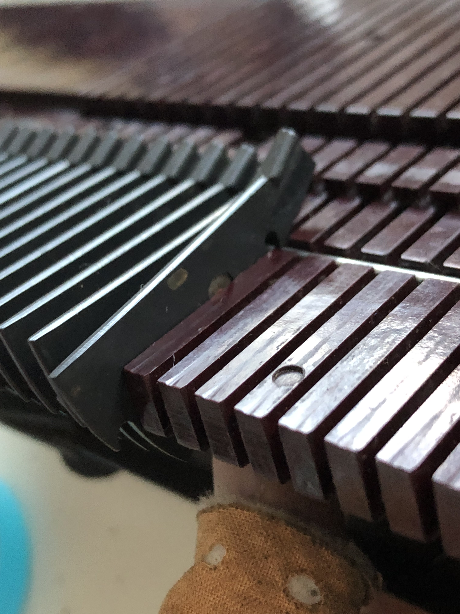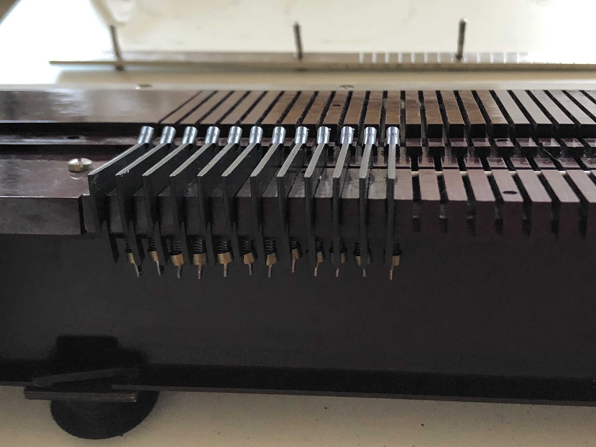
- Nadeln wiedereinlegen  
  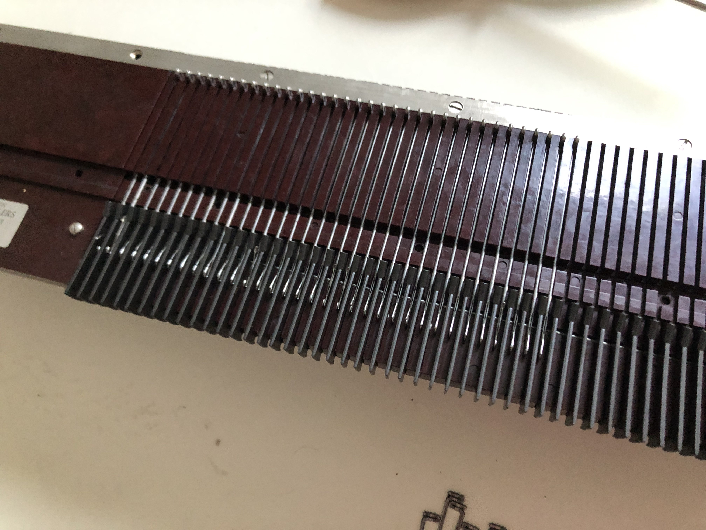
- Metallschiene anschrauben
- vordere Abdeckplatte anlegen
- Seitenteile anschrauben
- Schlitten wieder einsetzen
- Feststellschrauben anschrauben
- hintere Nadelhaken ölen
- Plättchen ölen
- einen Tag ruhen lassen
